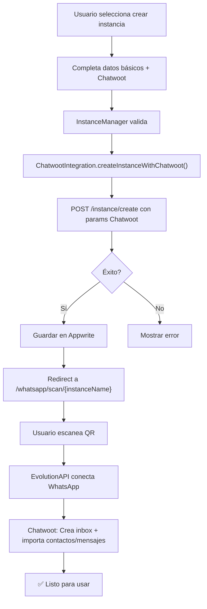

# 🔗 Integración Evolution API + Chatwoot Self-Hosted

## 📋 Descripción

Esta guía documenta cómo configurar una integración automática entre **EvolutionAPI v2** y **Chatwoot self-hosted** para gestionar conversaciones de WhatsApp centralizadamente.

## 🎯 Qué Logras

- ✅ Conversaciones de WhatsApp sincronizadas en Chatwoot
- ✅ Importación automática de contactos
- ✅ Historial de mensajes disponible
- ✅ Inbox automático en Chatwoot
- ✅ Firma de agente en mensajes
- ✅ Reapertura de conversaciones cerradas

## 📡 Endpoints de EvolutionAPI Utilizados

### 1. Crear Instancia con Chatwoot

```
POST /instance/create
```

**Qué hace**: Crea una instancia de WhatsApp y configura Chatwoot automáticamente en el mismo paso.

**Body mínimo**:
```json
{
  "instanceName": "soporte_001",
  "qrcode": true,
  "integration": "WHATSAPP-BAILEYS",
  "chatwootAccountId": "1",
  "chatwootToken": "cwt_1234567890",
  "chatwootUrl": "https://chatwoot.example.com",
  "chatwootImportContacts": true,
  "chatwootImportMessages": true
}
```

### 2. Configurar Chatwoot en Instancia Existente

```
POST /chatwoot/set/{instanceName}
```

**Qué hace**: Actualiza la configuración de Chatwoot para una instancia ya crear.

**Body**:
```json
{
  "enabled": true,
  "accountId": "1",
  "token": "cwt_1234567890",
  "url": "https://chatwoot.example.com",
  "autoCreate": true,
  "importContacts": true,
  "importMessages": true
}
```

### 3. Obtener Configuración Actual

```
GET /chatwoot/find/{instanceName}
```

**Qué hace**: Retorna la configuración actual de Chatwoot para debugging.

## 🔐 Obtener Token de Chatwoot

### Pasos:

1. **Acceder a Chatwoot** → Profile (esquina superior derecha)
2. **Settings** → **API Tokens**
3. **Create new token**
4. Copiar el token (se muestra solo una vez)
5. Guardar en variables de entorno

```env
CHATWOOT_API_TOKEN=cwt_xxxxxxxxxxxxxxxx
CHATWOOT_ACCOUNT_ID=1
CHATWOOT_URL=https://tu-chatwoot.com
```

## 📊 Estructura de Datos Chatwoot

### En el Frontend (Appwrite Document)

```json
{
  "instance_name": "soporte_001",
  "status": "pending",
  "user_id": "...",
  
  // Campos Chatwoot
  "chatwoot_url": "https://chatwoot.example.com",
  "chatwoot_account_id": "1",
  "chatwoot_token": "cwt_xxx",
  "chatwoot_sign_msg": true,
  "chatwoot_reopen_conversation": true,
  "chatwoot_import_contacts": true,
  "chatwoot_import_messages": true,
  "chatwoot_organization": "Bot Support",
  "chatwoot_name_inbox": "WhatsApp Support"
}
```

## 🚀 Flujo de Creación Completamente Automatizado



## ⚙️ Parámetros Detallados

| Parámetro | Obligatorio | Default | Descripción |
|-----------|-------------|---------|------------|
| `accountId` | ✅ | - | ID de cuenta en Chatwoot (usualmente 1) |
| `token` | ✅ | - | API token admin de Chatwoot |
| `url` | ✅ | - | URL base de Chatwoot (sin trailing slash) |
| `signMsg` | ❌ | true | Añadir firma de agente |
| `reopenConversation` | ❌ | true | Reabrir conversaciones cerradas |
| `importContacts` | ❌ | true | Importar contactos desde WhatsApp |
| `importMessages` | ❌ | true | Importar mensajes históricos |
| `daysLimitImportMessages` | ❌ | 30 | Días de historial a importar |
| `autoCreate` | ❌ | true | Crear inbox automáticamente |
| `nameInbox` | ❌ | "WhatsApp {instanceName}" | Nombre visible en Chatwoot |
| `organization` | ❌ | "Bot Automation" | Nombre de la organización |
| `mergeBrazilContacts` | ❌ | true | Unificar contactos con formato BR |

## 🧪 Testing Manual

### Con cURL:

```bash
curl -X POST "http://evolution-api:8080/instance/create" \
  -H "apikey: EvoAPI2024" \
  -H "Content-Type: application/json" \
  -d '{
    "instanceName": "test_001",
    "qrcode": true,
    "chatwootAccountId": "1",
    "chatwootToken": "cwt_xyz",
    "chatwootUrl": "https://chatwoot.example.com",
    "chatwootImportContacts": true,
    "chatwootImportMessages": true,
    "chatwootDaysLimitImportMessages": 30
  }'
```

### Respuesta esperada:

```json
{
  "success": true,
  "message": "Instance created successfully",
  "response": {
    "instanceName": "test_001",
    "status": "CREATED",
    "qrcode": "data:image/png;base64,..."
  }
}
```

## 🐛 Troubleshooting

### Error: "Chatwoot connection failed"

**Causa**: URL incorrecta o token inválido

**Solución**:
1. Verificar que Chatwoot está accesible desde EvolutionAPI
2. Verificar token en Chatwoot: Profile → API Tokens
3. Asegurar que URL no tiene trailing slash

### Error: "Account not found"

**Causa**: `accountId` incorrecto

**Solución**:
1. En Chatwoot: Settings → Accounts
2. Copiar el ID correcto (generalmente es 1)

### Contactos no se importan

**Causa**: `importContacts: false` o permisos en Chatwoot

**Solución**:
1. Asegurar `importContacts: true` en config
2. Verificar permisos de admin en Chatwoot
3. Revisar logs de EvolutionAPI

## 📚 Código de Ejemplo Completo

### Node.js + Express:

```typescript
import ChatwootIntegration from './utility/chatwootIntegration';

const router = express.Router();

router.post('/create-with-chatwoot', async (req, res) => {
  try {
    const { instanceName, chatwootConfig } = req.body;

    const integration = new ChatwootIntegration(
      process.env.VITE_SERVER_URL!,
      process.env.VITE_API_KEY!
    );

    const result = await integration.createInstanceWithChatwoot(
      instanceName,
      {
        accountId: chatwootConfig.accountId,
        token: chatwootConfig.token,
        url: chatwootConfig.url,
        importContacts: true,
        importMessages: true,
        daysLimitImportMessages: 30,
      }
    );

    res.json(result);
  } catch (error: any) {
    res.status(400).json({
      success: false,
      message: error.message,
    });
  }
});

export default router;
```

## ✅ Verificación Post-Creación

Después de crear una instancia con Chatwoot:

1. ✅ En EvolutionAPI: Status debe ser `connecting` o `connected`
2. ✅ En Chatwoot: Debe existir la bandeja/inbox
3. ✅ En Chatwoot: Contactos deben estar importados
4. ✅ En Chatwoot: Mensajes recientes deben estar importados
5. ✅ En WhatsApp: El celular debe estar conectado

## 🔄 Actualizar Configuración Posterior

Si necesitas cambiar configuración después de crear:

```typescript
const integration = new ChatwootIntegration(
  process.env.VITE_SERVER_URL!,
  process.env.VITE_API_KEY!
);

await integration.updateChatwootConfig('test_001', {
  accountId: '1',
  token: 'cwt_xyz',
  url: 'https://chatwoot.example.com',
  reopenConversation: false, // Cambiar comportamiento
  importing: false,
});
```

## 📖 Referencias

- [EvolutionAPI Docs](https://doc.evolution-api.com/)
- [Chatwoot Docs](https://www.chatwoot.com/docs/)
- [Chatwoot API](https://www.chatwoot.com/docs/platform/apis/)

---

**Versión**: 1.0  
**Última actualización**: 24 de Enero, 2026  
**Estado**: ✅ Completamente implementado
